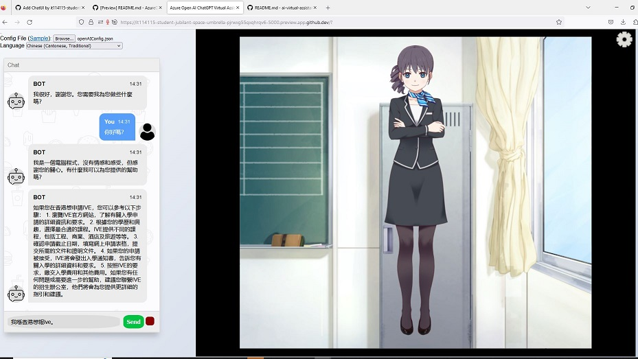

# Azure OpenAI Live2D Virtual Assistant

This is a sample implementation of an application that displays models output by Live2D Cubism 4 Editor from Cubism Web Samples with Azure OpenAI and Azure Text to Speech.

It is used in conjunction with the Cubism Web Framework and Live2D Cubism Core.


Screen shoot




## Demo
For English

[](https://youtu.be/z-Fl_kzrDpA)

For Cantonese

[](https://youtu.be/0291zqM4da0)


## Deployment
1. Login Azure CLI ```az login --use-device-code```
2. Create Classic GITHUB TOKEN with permission delete_repo, repo
3. Open a terminal ```export GITHUB_TOKEN=xxxxx``` with your GitHub Token. Or, create .env from .env.template .
4. Run ```./deploy.sh```
5. After the deployment completed, you will have a new repo uniquePrefix+"AzureOpenAILive2DChatbotCICD".
6. Rerun the failed GitHub Actions.
7. Open Microsoft Azure Storage Explore and update users table. Both PartitionKey and RowKey are the email.

> Deployment of cognitiveAccount/openAiCognitiveAccount may timeout and you may need to re-run the deployment after the creation completed.

[](https://youtu.be/NNtsusafTCQ)

## For version deployment
You need to update the /workspaces/AzureOpenAILive2DChatbot/cdktf/main.ts
```
    const uniquePrefix = "ivechat";
    const region = "eastasia";
```

## Undeployment
1. Delete "AzureOpenAILive2DChatbotCICD" repo yourself.
2. Run ```./undeploy.sh```


## License

Please check the [license](LICENSE.md) before using this SDK.


## Notices

Please check the [notices](NOTICE.md) before using this SDK.


## Directory structure

```
.
├─ .vscode          # Project settings directory for Visual Studio Code
├─ Core             # Directory containing Live2D Cubism Core
├─ Framework        # Directory containing source code such as rendering and animation functions
├─ website          # Directory containing source code for the web
├─ cdktf            # Directory containing source code for Azure deployment.

```


## Live2D Cubism Core for Web

A library for loading the model.

This repository does not manage Cubism Core.
Download the Cubism SDK for Web from [here](https://www.live2d.com/download/cubism-sdk/download-web/) and copy the files in the Core directory.


## Development environment construction

1. Create a new CodeSpace.
2. Install [Node.js] and [Visual Studio Code]
3. Open **the top directory of this SDK** in Visual Studio Code and install the recommended extensions
    * In addition to pop-up notifications, you can check the others by typing `@recommended` from the Extensions tab
4. You need to go to Live2D website to get your free license packages.
5. Copy the file to Framework.

### Operation check of sample demo

Enter `>Tasks: Run Task` in the command palette (*View > Command Palette...*) to display the task list.

1. Select `npm: install - Samples/TypeScript/Demo` from the task list to download the dependent packages
1. Select `npm: build - Samples/TypeScript/Demo` from the task list to build the sample demo
1. Select `npm: serve - Samples/TypeScript/Demo` from the task list to start the simple server for operation check
1. Enter `http://localhost:5000/website/` in the URL field of your browser to access it
1. Enter `>Tasks: Terminate Task` from the command palette and select `npm: serve` to terminate the simple server

For other tasks, see [README.md](Samples/TypeScript/README.md) of the sample project.

NOTE: Settings for debugging are described in `.vscode/tasks.json`.


### Project debugging

Open **the top directory of this SDK** in Visual Studio Code and enter the *F5* key to start Debugger for Chrome.

You can place breakpoints in Visual Studio Code to debug in conjunction with the Chrome browser.

NOTE: Settings for debugging are described in `.vscode/launch.json`.


## SDK manual

[Cubism SDK Manual](https://docs.live2d.com/cubism-sdk-manual/top/)


## Changelog

Please refer to [CHANGELOG.md](CHANGELOG.md) for the changelog of this repository.


## Development environment

### Node.js

* 18.8.0
* 16.17.0
* 14.20.0


## Operation environment

| Platform | Browser | Version |
| --- | --- | --- |
| Android | Google Chrome | 104.0.5112.97 |
| Android | Microsoft Edge | 104.0.1293.63 |
| Android | Mozilla Firefox | 104.1.0 |
| iOS / iPadOS | Google Chrome | 104.0.5112.99 |
| iOS / iPadOS | Microsoft Edge | 104.0.1293.63 |
| iOS / iPadOS | Mozilla Firefox | 104.0 |
| iOS / iPadOS | Safari | 15.6.1 |
| macOS | Google Chrome | 104.0.5112.101 |
| macOS | Microsoft Edge | 104.0.1293.70 |
| macOS | Mozilla Firefox | 104.0 |
| macOS | Safari | 15.6.1 |
| Windows | Google Chrome | 104.0.5112.102 |
| Windows | Microsoft Edge | 104.0.1293.70 |
| Windows | Mozilla Firefox | 104.0 |

Note: You can start the server for operation check by running the `serve` script of `./website/package.json`.


## Contributing

There are many ways to contribute to the project: logging bugs, submitting pull requests on this GitHub, and reporting issues and making suggestions in Live2D Community.

### Forking And Pull Requests

We very much appreciate your pull requests, whether they bring fixes, improvements, or even new features. Note, however, that the wrapper is designed to be as lightweight and shallow as possible and should therefore only be subject to bug fixes and memory/performance improvements. To keep the main repository as clean as possible, create a personal fork and feature branches there as needed.

### Bugs

We are regularly checking issue-reports and feature requests at Live2D Community. Before filing a bug report, please do a search in Live2D Community to see if the issue-report or feature request has already been posted. If you find your issue already exists, make relevant comments and add your reaction.

### Suggestions

We're also interested in your feedback for the future of the SDK. You can submit a suggestion or feature request at Live2D Community. To make this process more effective, we're asking that you include more information to help define them more clearly.


## Community

If you want to suggest or ask questions about how to use the Cubism SDK between users, please use the community.

- [Live2D community](https://community.live2d.com/)
- [Live2D 公式コミュニティ (Japanese)](https://creatorsforum.live2d.com/)
